# os-notes


### Intel Processor Execution Modes

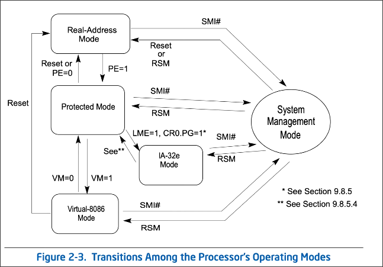


- **Real Mode**:
This mode implements the programming environment of the Intel 8086 processor with extensions (such as the ability to switch to protected or system management mode). The processor is placed in real-address mode following power-up or a reset.

No virtual memory, no privilege rings, 16 but mode. For example, DOS runs in real mode.
If we reset our processor, it is going to go back into real mode. So everything always starts in real mode every time we power on and power off the processor.
It is the job of the BIOS to get us out of real mode as soon as possible.

=> For more informations, let's see : [Architecture 4021: Introduction UEFI](https://www.youtube.com/watch?v=HgGwqG1Fiao&list=PLUFkSN0XLZ-ltETI20mpXOCdqC8rdven6)


- **Protected Mode:**
This mode is the native state of the processor. Among the capabilities of protected mode
is the ability to directly execute “real-address mode” 8086 software in a protected, multi-tasking environment. This feature is called virtual-8086 mode, although it is not actually a processor mode. Virtual-8086 mode is actually a protected mode attribute that can be enabled for any task.


- **System management mode (SMM):**
This mode provides an operating system or executive with a transparent mechanism for implementing platform-specific functions such as power management and system security. The processor enters SMM when the external SMM interrupt pin (SMI#) is activated or an SMI is received from the advanced programmable interrupt controller (APIC).


### CPUID

WIP

### Model Specific Registers (MSRs)
The mnemonic cpuid is the way that software finds out what features are supported, but how to enable it ?
=> MSRs provide a way on Intel systems to support an number of feature flags. The list is so big that Intel eventually split it out into Volume 4 of the manuals.

Naming Caveat : architectural MSRs were given the prefix "IA32_". However, it's not specific limited to 32 bits execution.

Using the instructions ```RDMSR``` and ```WRMSR```, the instruction can only be run in kernel mode.

```UA32_EFER``` is the Extended Feature Enables. The bit 8 (LME -- Long Mode Enable) is used to go from protected mode into 64-bit mode. The bit 10 (LMA) telling us if the mode is active right now or not. 

### Segmentation
Segmentation provides a mechanism of isolating individual code, data, and stack modules so that multiple programs (or tasks) can run on the same processor without interfering with one another. Paging provides a mechanism for implementing a conventional demand-paged, virtual-memory system where sections of a program’s execution environment are mapped into physical memory as needed. Paging can also be used to provide isolation between multiple tasks. When operating in protected mode, some form of segmentation must be used. There is no mode bit to disable segmentation. The use of paging, however, is optional.

We are going to use a logical address to locate a byte in a particular segment. A logical address consists of a segment selector and an offset. The physical address space is defined as the range of addresses that the processor can generate on its address bus. Linear address space is a flat 64 bit space.

- **32 bit Near Pointer vs Far Pointer**
A Far Pointer is a 32 bit value with a selector put in a front of it 1(16bit value).

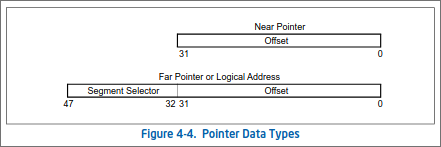

- **64 bit Near Pointer vs Far Pointer**
A Far Pointer is a 64 bit Near Pointer value with a 16 bit Segment Selector.

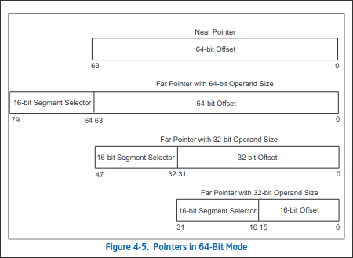

Segmentation translates logical addresses to linear addresses, automatically, in hardware, by using table lookups. But software fills in the tables. Logical address (far pointer) = 16 bit segment selector + 32/64 bit offset.

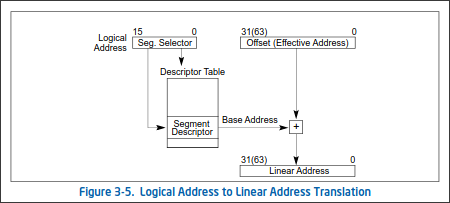

If paging is not used, the processor maps the linear address directly to a physical address (that is, the linear address goes out on the processor’s address bus). If the linear address space is paged, a second level of address translation is used to translate the linear address into a physical address.

To translate a logical address into a linear address, the processor does the following:
1. Uses the offset in the segment selector to locate the segment descriptor for the segment in the GDT or LDT and reads it into the processor. (This step is needed only when a new segment selector is loaded into a segment register.)
2. Examines the segment descriptor to check the access rights and range of the segment to ensure that the segment is accessible and that the offset is within the limits of the segment.
3. Adds the base address of the segment from the segment descriptor to the offset to form a linear address.

A segment selector is a 16-bit identifier for a segment (see Figure 3-6). It does not point directly to the segment, but instead points to the segment descriptor that defines the segment.

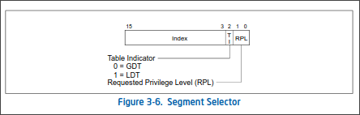

It is used to select a different data structure from one of two tables : GDT, LDT. The index is actually 13 bits not 16, so the tables can each hold a maximum of $2^{13} = 8191$ data structures 


  
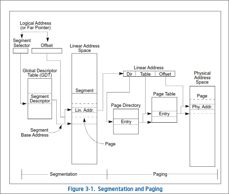


In IA-32e mode of Intel 64 architecture, the effects of segmentation depend on whether the processor is running in compatibility mode or 64-bit mode. In compatibility mode, segmentation functions just as it does using legacy 16-bit or 32-bit protected mode semantics.

In 64-bit mode, segmentation is generally (but not completely) disabled, creating a flat 64-bit linear-address space. The processor treats the segment base of CS, DS, ES, SS as zero, creating a linear address that is equal to the effective address. The FS and GS segments are exceptions. These segment registers (which hold the segment base) can be used as additional base registers in linear address calculations. They facilitate addressing local data
and certain operating system data structures. 
Note that the processor does not perform segment limit checks at runtime in 64-bit mode.

- **Basic Flat Model**
The simplest memory model for a system is the basic “flat model,” in which the operating system and application programs have access to a continuous, unsegmented address space. To the greatest extent possible, this basic flat model hides the segmentation mechanism of the architecture from both the system designer and the application programmer.

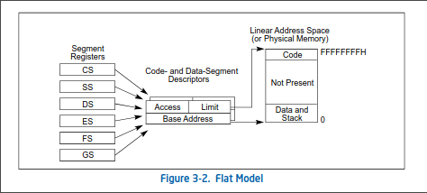

To implement a basic flat memory model with the IA-32 architecture, at least two segment descriptors must be created, one for referencing a code segment and one for referencing a data segment (see Figure 3-2). Both of these segments, however, are mapped to the entire linear address space: that is, both segment descriptors have the same base address value of 0 and the same segment limit of 4 GBytes. By setting the segment limit to 4 GBytes, the segmentation mechanism is kept from generating exceptions for out of limit memory references, even if no physical memory resides at a particular address. ROM (EPROM) is generally located at the top of the physical address space, because the processor begins execution at FFFF_FFF0H. RAM (DRAM) is placed at the bottom of the address space because the initial base address for the DS data segment after reset initialization is 0.


- **Protected Flat Model**
The protected flat model is similar to the basic flat model, except the segment limits are set to include only the range of addresses for which physical memory actually exists (see Figure 3-3). A general-protection exception (#GP) is then generated on any attempt to access nonexistent memory. This model provides a minimum level of hardware protection against some kinds of program bugs.

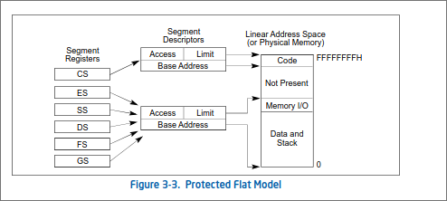

**Reading/Writing Segment Registers with MOV**
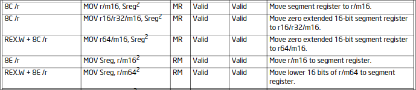

**Reading/Writing Segment Registers with PUSH/POP**
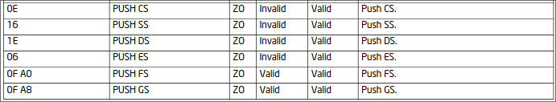

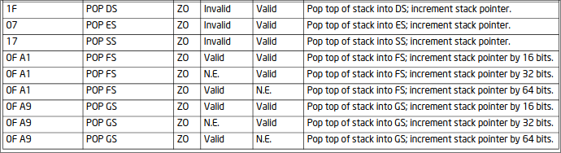


Every segment register has a “visible” part and a “hidden” part. (The hidden part is sometimes referred to as a “descriptor cache” or a “shadow register.”) When a segment selector is loaded into the visible part of a segment register, the processor also loads the hidden part of the segment register with the base address, segment limit, and access control information from the segment descriptor pointed to by the segment selector. The information cached in the segment register (visible and hidden) allows the processor to translate addresses without taking extra bus cycles to read the base address and limit from the segment descriptor. In systems in which multiple processors have access to the same descriptor tables, it is the responsibility of software to reload the segment registers when the descriptor tables are modified. If this is not done, an old segment descriptor cached in a segment register might be used after its memory-resident version has been modified.


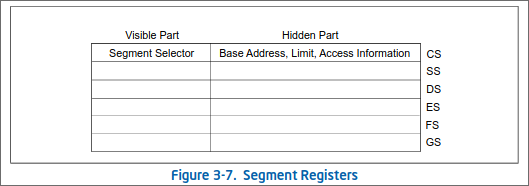

The hidden part is especially used by the segment descriptor (LDT or GDT) to write informations (Base, Limit, => Access <=). 
Segmentation is not optional, it is still used, but it is used in a much more limited form than what it was originally designed for.

### GDT & LDT

- GDTR

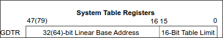

The upper 64bits ("base address") of the register specifies the linear address where the GDT is stored. The lower 16bits ("table limit") specify the size of the table in bytes (with base+limit specifying the address of the last valid/included byte). Special instructions used to load a value into the register or store the value out to memory (```LGDT```: load 10 bytes from memory into GDTR, ```SGDT```: store 10 bytes of GDTR to memory)

- LDTR

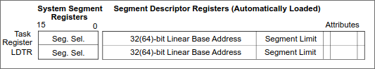

Like the 16-bit segment registers, the 16-bit LDTR has a visible part, the segment selector, and a hidden part, the cached segment info which specifies the size of the LDT.
	The selector's Table Indicator (T) bit must be set to 0 to specify that it's selecting from GDT, not from itself.
Special instructions used to load a value into the register or store the value out to memory (```LLDT```: load 16 bit segment selector into LDTR, ```SLDT```: store 16 bit segment selector of LDTR to memory)

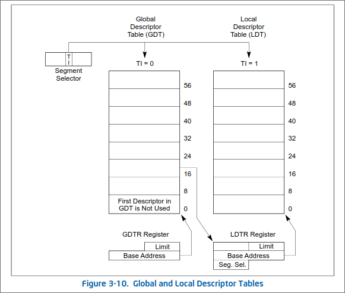

A segment descriptor table is an array of segment descriptors (see Figure 3-10). A descriptor table is variable in length and can contain up to 8192 (213 ) 8-byte descriptors. There are two kinds of descriptor tables:
- The global descriptor table (GDT).
- The local descriptor tables (LDT).

Each system must have one GDT defined, which may be used for all programs and tasks in the system. Optionally, one or more LDTs can be defined. For example, an LDT can be defined for each separate task being run, or some or all tasks can share the same LDT.

The GDT is not a segment itself; instead, it is a data structure in linear address space. The base linear address and limit of the GDT must be loaded into the GDTR register (see Section 2.4, “Memory-Management Registers”). The base address of the GDT should be aligned on an eight-byte boundary to yield the best processor performance. The limit value for the GDT is expressed in bytes. As with segments, the limit value is added to the base address to get the address of the last valid byte. A limit value of 0 results in exactly one valid byte. Because segment descriptors are always 8 bytes long, the GDT limit should always be one less than an integral multiple of eight (that is, 8N – 1). 

The first descriptor in the GDT is not used by the processor. A segment selector to this “null descriptor” does not generate an exception when loaded into a data-segment register (DS, ES, FS, or GS), but it always generates a general-protection exception (#GP) when an attempt is made to access memory using the descriptor. By initializing the segment registers with this segment selector, accidental reference to unused segment registers can be guaranteed to generate an exception. 

The LDT is located in a system segment of the LDT type. The GDT must contain a segment descriptor for the LDT segment. If the system supports multiple LDTs, each must have a separate segment selector and segment descriptor in the GDT. The segment descriptor for an LDT can be located anywhere in the GDT. See Section 3.5, “System Descriptor Types,” for information on the LDT segment-descriptor type.

An LDT is accessed with its segment selector. To eliminate address translations when accessing the LDT, the segment selector, base linear address, limit, and access rights of the LDT are stored in the LDTR register (see Section 2.4, “Memory-Management Registers”).

When the GDTR register is stored (using the SGDT instruction), a 48-bit “pseudo-descriptor” is stored in memory. To avoid alignment check faults in user mode (privilege level 3), the pseudo-descriptor should be located at an odd word address (that is, address MOD 4 is equal to 2). This causes the processor to store an aligned word, followed by an aligned doubleword. User-mode programs normally do not store pseudo-descriptors, but the possibility of generating an alignment check fault can be avoided by aligning pseudo-descriptors in this way. The same alignment should be used when storing the IDTR register using the SIDT instruc-tion. 

When storing the LDTR or task register (using the SLDT or STR instruction, respectively), the pseudo-descriptor should be located at a doubleword address (that is, address MOD 4 is equal to 0).


### Segment Descriptors
Each entry in the GDT and LDT is a data structure called a Segment Descriptor. Each Segment Descriptor describes a segment.

Each segment descriptor has an associated segment selector. A segment selector provides the software that uses it with an index into the GDT or LDT (the offset of its associated segment descriptor), a global/local flag (determines whether the selector points to the GDT or the LDT), and access rights information.

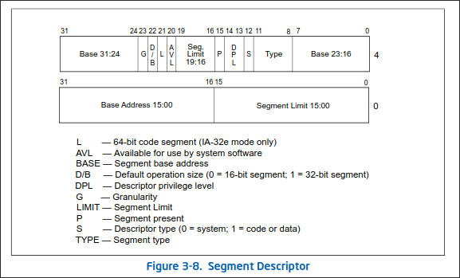

To access a byte in a segment, a segment selector and an offset must be supplied. The segment selector provides access to the segment descriptor for the segment (in the GDT or LDT). From the segment descriptor, the processor obtains the base address of the segment in the linear address space. The offset then provides the location of the byte relative to the base address. This mechanism can be used to access any valid code, data, or stack segment, provided the segment is accessible from the current privilege level (CPL) at which the processor is operating. The CPL is defined as the protection level of the currently executing code segment.

The linear address of the base of the GDT is contained in the GDT register (GDTR); the linear address of the LDT is contained in the LDT register (LDTR).

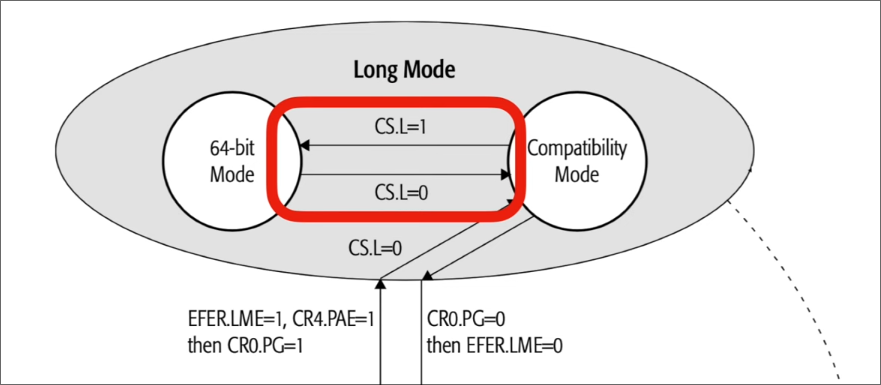

- L Flag (bit 21): Whether this is a 64-bit segment or not (if not, it's Compatibility Mode, which exhibits 32-bit protected mode behavior) => CS.L=1 (64bits) - CS.L=0 (CM)

- Base (32bits): linear address where the segment start, **for Compatibility Mode**. For 64-bit mode, the base is juste always treated as 0 for CS, SS, DS, ES. For FS and GS, the hidden part of the segment registers is mapped into the **IA32_FS_BASE** (0xc0000100) and **IA32_GS_BASE** (0xC0000101) MSRs respectively. So a full 64bit address can be written there instead of in the segment descriptor

- Limit (20bits): size of the segment (in bytes or 4kb blocks), for Compatibility Mode. Limits are not actulaly checked anymore in 64 bit mode, even for FS and GS.

- G Flag: whether the Limit is specified in bytes or 4096 byte chunks, for Compatibility Mode. Not  used in 64-bit mode.

- P Flag: 0 for not present. 1 for present.
	if this flag is clear, the processor generates a segment-not-present exception (#NP) when a segment selector that points to the segment descriptor is loaded into a segment register

- S Flag: 0 for System segment. 1 for Code or Data segment

- Type (4bits): Different types for System and non-System (i.e. Code & Data) descriptors. <br> **What was the point of Expand-Down segment ?** => Originally for Stack Segments, to allow for growth towards lower addresses. Although a read-only && expand-down segment can't be used for stack segments... Loading the SS register with a segment generates a general-protection exception (#GP). <br> <br> **Conforming vs Non-Conforming Segments**: Conforming segments allow lower privilege code to execute them (ring 3 code could just jump into Ring 0 conforming segments and keep running). Non-conforming segments behave how you'd expect from a security perspective, and will throw a general protection fault if someone from a lower privilege level tries to execute them

- D/B Flag: used for completely different stuff based on the descriptor type. <br>**Code Segment:** "D" (Default Opcode Size) flag, this is what actually controls whether an overloaded opcode is interpreted as dealing with 16 or 32 but register/memory sizes. The processor fetched a 0x25 in the isntruction stream, how would it know whether it should be followed by 2 bytes (imm16) or 4 bytes (imm32) ? => if the D flag == 0 it's 16bits, and if D == 1 it's 32bits. The instruction prefix 66H can be used to select and operand size other than the default. 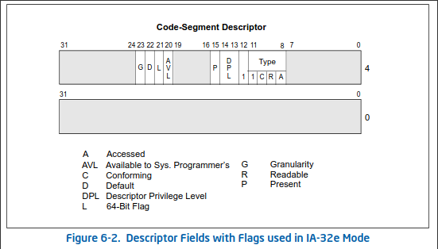 <br><br>**Stack Segment (data segment pointed to by the SS register):** B (Big) Flag, whether implicit stack pointer usage (e.g. push/pop/call) moves stack pointer by 16 bits (if B is 0), or 32 bits (if B is 1).<br>**Expand-Down Data Segment:** B Flag, 0 = upper bound of 0xFFFF, 1 = upper bound of 0xFFFFFFFF. No one really uses expand down segments ... 

- DPL Flags (2 bits): PRivilege Ring of the segment for access controls. If this is a non-conforming segment descriptor && DPL == 0, only ring 0 code can execute from within this segment. If this i s a data segment selector && DPL == 0, only ring 0 code can read/write data from/to this segment

- Available Flag: No specific usage defined. Available for OSes to use it or not use it as they see fit.

***Other types of descriptors in 64-bit Mode***
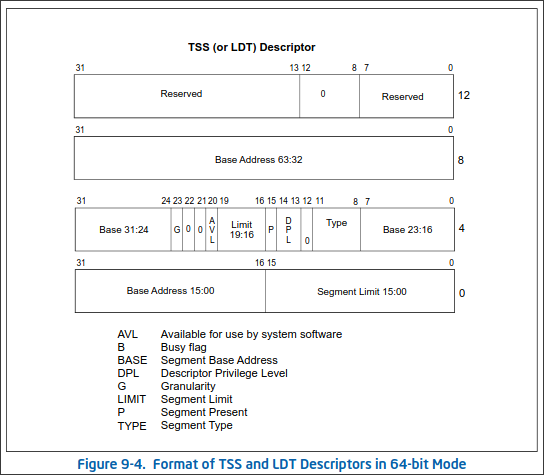

The system segment descriptor for the TSS and the LDT, in the GDT there is an entry that points to the DLT and that entry has been expanded to be 16 bytes large, so that the base address which previously could only hold a 32-bit value is expanded to a 64-bit value.
<br><br><br>If attempting a control flow transition via JMP/Jcc/CALL/RET from one segment into a different segment, the hardware will check the DPL of the target segment and allow the access only if CPL <= DPL. 
<br>Some of the system instructions (called “privileged instructions”) are protected from use by application programs. The privileged instructions control system functions (such as the loading of system registers). They can be executed only when the CPL is 0 (most privileged). If one of these instructions is executed when the CPL is not 0, a general-protection exception (#GP) is generated.<br>The following system instructions are privileged instructions:
- LTR — Load task register.
- LIDT — Load IDT register.
- MOV (control registers) — Load and store control registers.
- LMSW — Load machine status word.
- CLTS — Clear task-switched flag in register CR0.
- MOV (debug registers) — Load and store debug registers.
- INVD — Invalidate cache, without writeback.
- WBINVD — Invalidate cache, with writeback.
- INVLPG —Invalidate TLB entry.
- HLT— Halt processor.
- RDMSR — Read Model-Specific Registers.
- WRMSR —Write Model-Specific Registers.
- RDPMC — Read Performance-Monitoring Counter.
- RDTSC — Read Time-Stamp Counter.
The PCE and TSD flags in register CR4 (bits 4 and 2, respectively) enable the RDPMC and RDTSC instructions, respectively, to be executed at any CPL.
<br> The MOV instruction cannot be used to load CS register. Attempting to do so results in an invalid opcode exception. Also, there is no "POP CS" instruction like there is for SS, DS, ES, FS, GS.

### Call Gates 
A Call Gates is a way to transfer control from on segment to another segment at a different privilege level.
<br>They are typically used only in operating systems or executives that use the privilege-level protection mechanism. Call gates are also useful for transferring program control between 16-bit and 32-bit code segments.

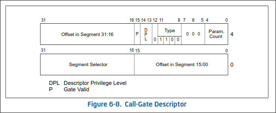

Call-gate descriptors in 32-bit mode provide a 32-bit offset for the instruction pointer (EIP); 64-bit extensions double the size of 32-bit mode call gates in order to store 64-bit instruction pointers (RIP).

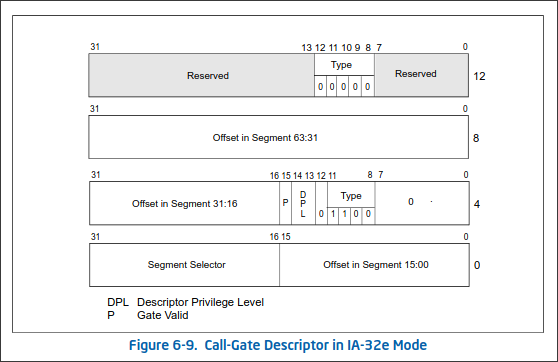.

To transition from CPL 3 to CPL 0, we would issue a CALL instruction, with a far pointer, that had a Segment Selector, that pointed at a Call Gate Segment Descriptor.

To access a call gate, a far pointer to the gate is provided as a target operand in a CALL or JMP instruction. The segment selector from this pointer identifies the call gate; the offset from the pointer is required, but not used or checked by the processor. (The offset can be set to any value.)<br>
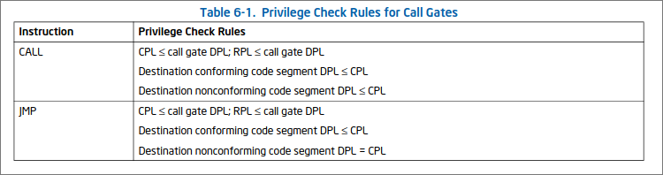

When the processor has accessed the call gate, it uses the segment selector from the call gate to locate the segment descriptor for the destination code segment. (This segment descriptor can be in the GDT or the LDT.) It then combines the base address from the code-segment descriptor with the offset from the call gate to form the linear address of the procedure entry point in the code segment.<br><br>Four different privilege levels are used to check the validity of a program control transfer
through a call gate:
- The CPL (current privilege level).
- The RPL (requestor privilege level) of the call gate’s selector.
- The DPL (descriptor privilege level) of the call gate descriptor.
- The DPL of the segment descriptor of the destination code segment.
The C flag (conforming) in the segment descriptor for the destination code segment is also checked.

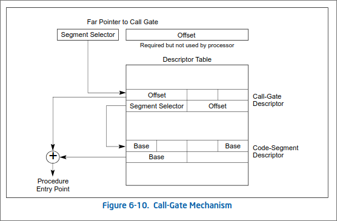

The privilege checking rules are different depending on whether the control transfer was initiated with a CALL or a JMP instruction.

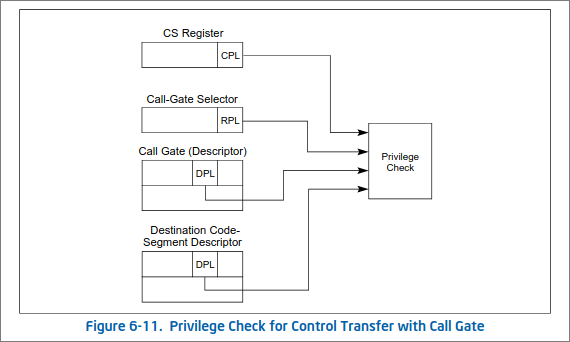

The DPL field of the call-gate descriptor specifies the numerically highest privilege level from which a calling procedure can access the call gate; that is, to access a call gate, the CPL of a calling procedure must be equal to or less than the DPL of the call gate. For example, in Figure 6-15, call gate A has a DPL of 3. So calling procedures at all CPLs (0 through 3) can access this call gate, which includes calling procedures in code segments A, B, and C. Call gate B has a DPL of 2, so only calling procedures at a CPL or 0, 1, or 2 can access call gate B, which includes calling procedures in code segments B and C. The dotted line shows that a calling procedure in code segment A cannot access call gate B.<br><br>
The RPL of the segment selector to a call gate must satisfy the same test as the CPL of the calling procedure; that is, the RPL must be less than or equal to the DPL of the call gate. In the example in Figure 6-15, a calling procedure in code segment C can access call gate B using gate selector B2 or B1, but it could not use gate selector B3 to access call gate B.<br>
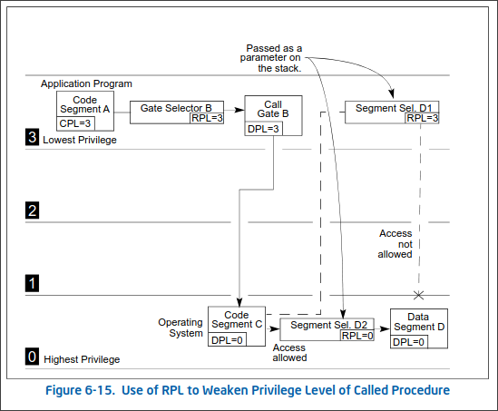

If the privilege checks between the calling procedure and call gate are successful, the  processor then checks the DPL of the code-segment descriptor against the CPL of the calling procedure. Here, the privilege check rules vary between CALL and JMP instructions. Only CALL instructions can use call gates to transfer program control to more privileged (numerically lower privilege level) nonconforming code segments; that is, to nonconforming code segments with a DPL less than the CPL. A JMP instruction can use a call gate only to transfer program control to a non conforming code segment with a DPL equal to the CPL. CALL and JMP instruction can both transfer program control to a more privileged conforming code segment; that is, to a conforming code segment with a DPL less than
or equal to the CPL.
<br>
How can i return from a call through a Call Gate ?<br>A normal CALL pushes RIP, a inter-privilege far CALL through a Call Gate pushes SS:RSP and CS:RIP, RET can pop those back off the stack to return from an inter-privilege far call.

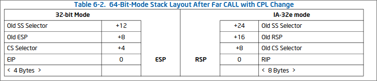
<br><br>

### Interrupts and Exceptions
Interrupts and exceptions are events that indicate that a condition exists somewhere in the system, the processor, or within the currently executing program or task that requires the attention of a processor.<br>
When an interrupt is received or an exception is detected, the currently running procedure or task is suspendedwhile the processor executes an interrupt or exception handler. When execution of the handler is complete, theprocessor resumes execution of the interrupted procedure or task. The resumption of the interrupted procedure ortask happens without loss of program continuity, unless recovery from an exception was not possible or an inter-rupt caused the currently running program to be terminated.<br>
The processor receives interrupts from two sources:
- External (hardware generated) interrupts
- Software-generated interrupts

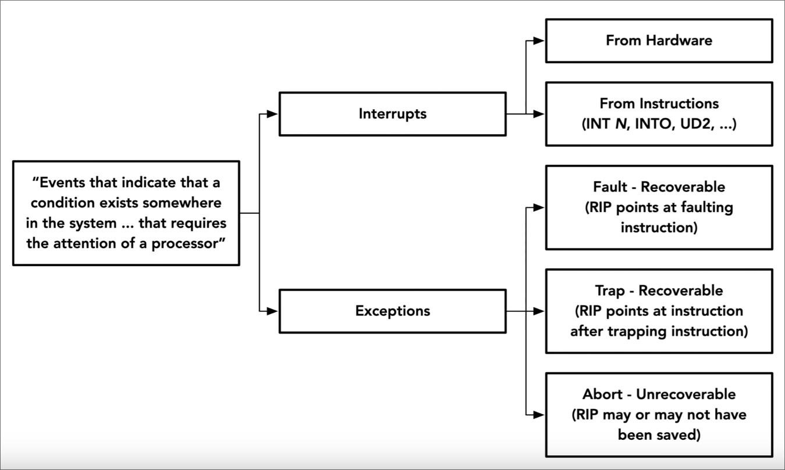


**Difference between Interrupt and Exception**<br>
Exceptions typically indicate error conditions, whereas interrupts typically indicate events from external hardware (Exception - E is for error). Interrupts clear the Interrupt Flag (IF), Exceptions do not. <br>
3 categories of exception:
- Fault - recoverable - pushed RIP points to **the faulting instruction**
- Trap - recoverable - pushed RIP points to **the instruction following the trapping instruction**
- Abort - unrecoverable -  **may not be able to save RIP where abort occurred**

#### Saving state

Previous 32-bit behavior
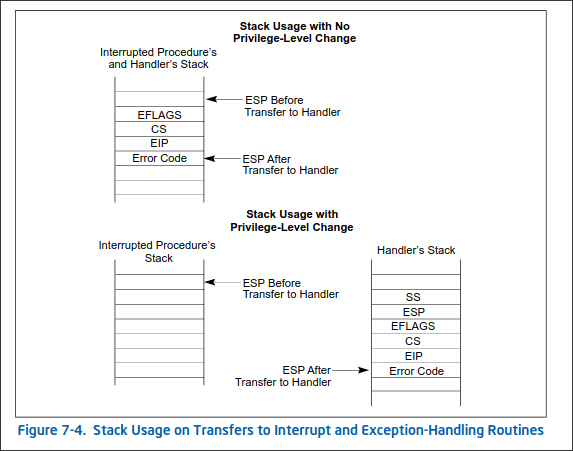

64-bit behavior
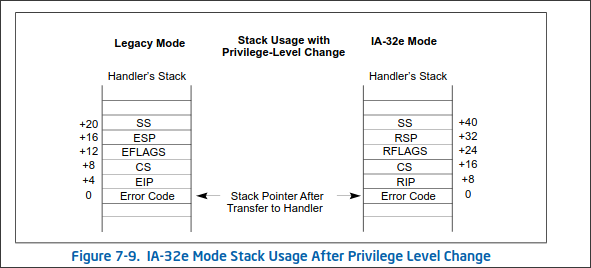

An interrupt (whether hardward or software) "PUSHes" save state onto the stack, so it can resume the previous execution after handling it. <br>
The ```IRET (Interrupt Return)``` instruction "POPs" it back off into the relevant registers, in the same sense that RET "POPs" a saved return address into RIP.

#### Software Generated Interrupts

- ```Int n```: Invoke Interrupt handler n. Important: while we can invoke anything in the IDT, some interrupts except an error code. INT does not push any error code, and therefore a handler may not behave correctly.
- ```IRET```: returns from an interrupt, popping all saved state back into the correct registers
- ```INT3```: There is a special one-byte "0xCC" opcode form that can be used to invoke interrupt 3 for software debug breakpoints.
- ```INT1```: There is a special one-byte "0xF1" opcode form that can be used to invoke interrupt 1 to fake hardware debug breakpoints
- ```INTO```: Invoke overflow interrupt if the overflow flag (OF) in RFLAGS is set to 1 (like a conditionnal ```INT 4```)
- ```UD2```: Invoke invalid opcode interrupt (same as ```INT 6```)
<br><br>Interrupts are another way to transfer control from one segment to another segment at a different privilege level.<br>How does the hardware decide where to push the interrupted procedure's saved state ?<br>=> To understand that, we need to learn about Tasks and Task-State Segment (TSS)

#### Tasks
The intel documentation often references the notion of a "task". It is a hardware mechanism to support multi-tasking, by saving/restoring task state, like registers. But it wasn't getting used for that purpose, so just like with segmentation, a lot of things were removed with the x86-64 extensions. But the Task-State Segment (TSS) is something which still **must** be used by the OS b virtue of being consulted on privilege changing interrupts, so we will at least talk about that.

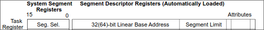

Like the 16-bit segment registers, and LDTR, the 16-bit TR has a visible part, the segment selector, and a hidden part, the cached segment info which specifies the size of the Task-State Segment (TSS). Special instructions used to load a value into the register or store the value out to memory. ```LTR - Load 16 bit segment into TR``` and ```STR - Store 16 bit segment selector of TR to memory```. <br>Call gates facilitate transitions between 64-bit mode and compatibility mode. Task gates are not supported in IA-32e mode. On privilege level changes, stack segment selectors are not read from the TSS. Instead, they are set to NULL.

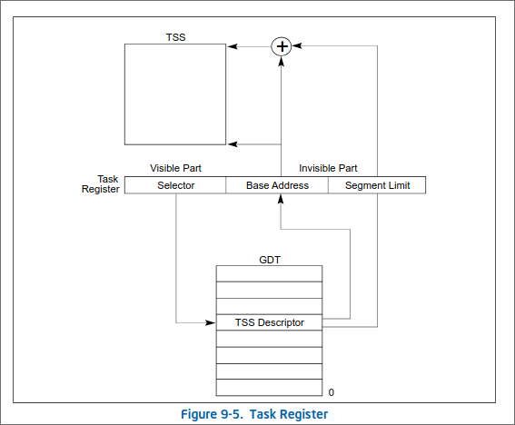

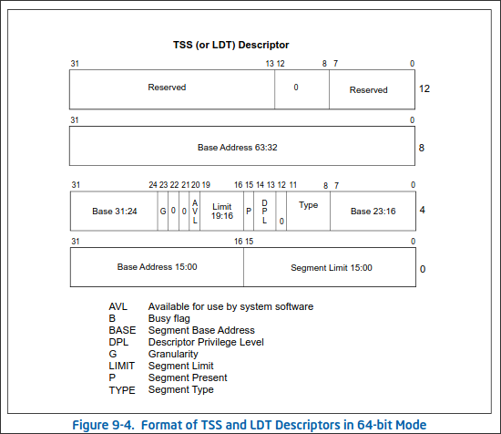

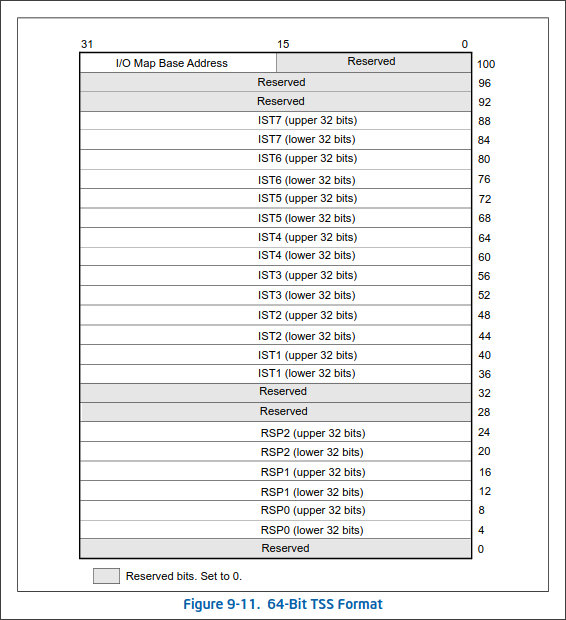

When interrupt is occuring and changing state into ring 0, ```RSP0``` will be used as the rsp to decided where to throw stuff on the stack. So the kernel needs to set this up, this needs to be in some kernel space location so that people can't tamper with it and this is were state will be saved. If processor was changing to ring 1, ```RSP1``` will be used instead and similarly if it was changing to ring 2, ```RSP2``` would be used instead.<br>There is also new elements for the x86-64 extensions called the interrupt stack table **IST**. It is a list of seven possible value that can be used for different interrupts. Interruptions can precise which stack they want to use.<br>
**TSS is still required because he holds a pointer to the stack, which is where the stack is going to be consider to start before the informations gets pushed on into the stack. So TSS helps the hardware to know where to push informations.**

#### Interrupt Decriptor Table (IDT)
There is a specific register which points at the base (0th entry) of the IDT. The **IDT R**egister is named ITDR. When interrupt/exception occurs, the hardware automatically : 
1. consults the IDTR
2. finds the appropriate offset in the IDT
3. pushes the saved state onto the stack (at a location determined by the TSS)
4. changes CS:RIP to the address of the interrupt handler, as read from the IDT entry (interrupt descriptor).

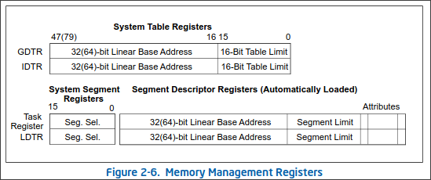


The IDTR register holds the base address (32 bits in protected mode; 64 bits in IA-32e mode) and 16-bit table limit for the IDT. The base address (upper 64bits of the register) specifies the linear address of byte 0 of the IDT; the table limit (the lower 16 bits) specifies the number of bytes in the table. The LIDT and SIDT instructions load and store the IDTR register, respectively. On power up or reset of the processor, the base address is set to the default value of 0 and the limit is set to 0FFFFH. The base address and limit in the register can then be changed as part of the processor initialization process.<br>Special instructions used to load a value into the register or store the value out to memory: 
- ```LIDT - Load 10 bytes from memory into IDTR```
- ```SIDT - Store 10 bytes of IDTR to memory```

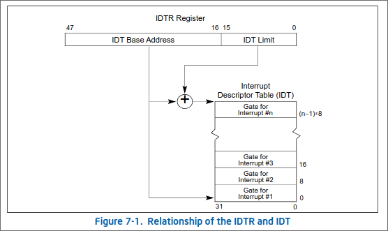

The IDT is an array of <= 256 16-byte decriptor entries. 0 through 31 are reserved for architecture-specific exceptions and interrupts. 32-255 are user-defined. While it interacts with segments, we can think of it as being an array of function (far) pointers, and when interrupt n is invoked by software or hardware, execution transfers to the address pointed to by the nth descriptor in the table. <br>
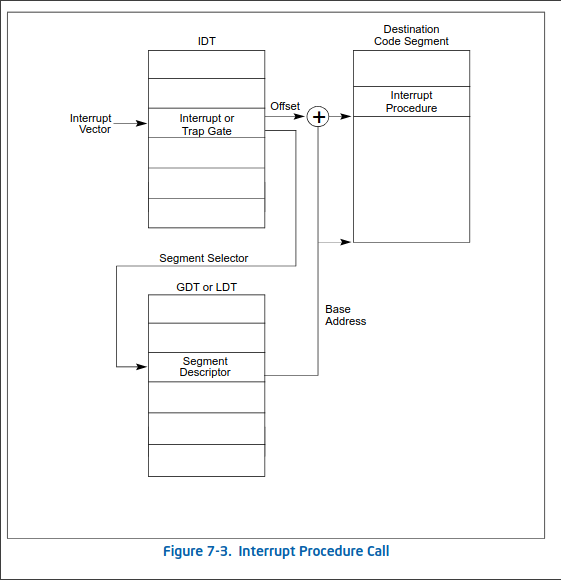

Here, base address isn't used. It's always going to be 0. But access control bits like DPL, will be checked.

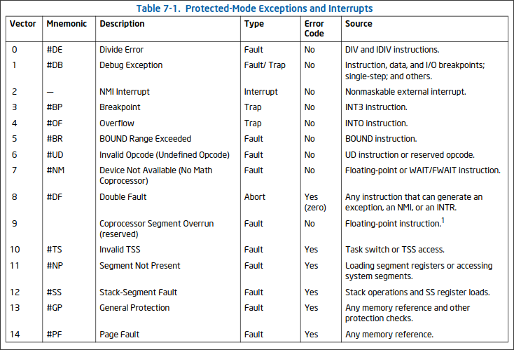
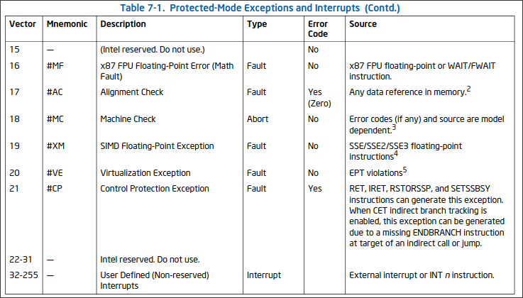

#### Interrupt Descriptors
The descriptors in the IDT describe one of two gate types:
- Interrupt Gate
- Trap Gate
The only difference between an interrupt gate and a trap gate is the way the processor handles the IF flag in the EFLAGS register. 

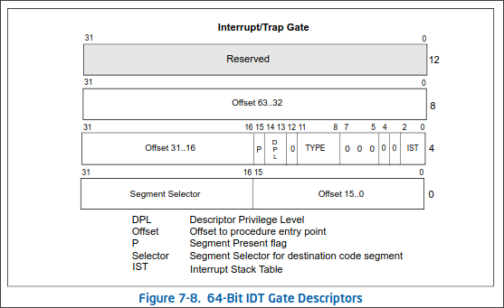

IDT entries contain a segment selector and a 64-bit offset. That looks like a "logical address" aka "far pointer".
- Type is binary 1110 for Interrupt Gate and 1111 for Trap Gate
- P(resent) bit should be set to 1 to indicate this is a valid / filled in entry, and 0 otherwise
- DPL is only checked when a descriptor is accessed by a software interrupt (ignored on hardware interrupts). Only allowed if CPL <= DPL
- IST != 0 specifies a specific index to use for the RSP as pulled from the TSS. This is a location where saved context will be pushed ("I want my RSP to be in that table").

#### Interrupt Masking
It is sometimes useful to disable some interrupts. (E.g. to stop an interrupt from occurring in the middle of handling another interrupt.) This is called "masking" the interrupt. The Interrupt Flag (IF) in the RFLAGS register is cleared automatically whenever an interrupt occurs through an Interrupt Gate. But, it is not cleared if we go through a Trap Gate. **This is the only difference between the two types of gates**. Maskable interrupts can be manually masked by clearing IF (```CLI - Clear IF``` and ```STI - Set IF```)<br><br>The IF does not mask the explicit invocation of an interrupt with the INT N/INT1/INT3/INT0/UD2 instructions. <br>The IF does not mask a Non Maskable Interrupt - IDT[2]

### System calls
The addition of privilege separation (e.g. Intel privilege rings), necessitates some way to transfer control between different execution domains. 
Multiple mechanisms can be used, in historical order : Call Gates, Interrupts, Syscalls


Interrupt Gate is the most compatible, but also the slowest. The instructions syscall and sysenter are the best. This why operating systems generally try to use these syscalls.
Dedicated system cal instructions are another way to transfer control from one segment to another segment at a different privilege level.

Preferred for 32-bit: SYSENTER/SYSEXIT (intel invented) - Preferred for 64-bit: SYSCALL/SYSRET (amd invented).

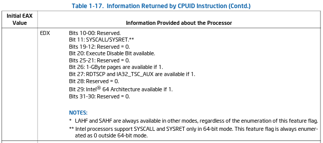

SYSCALL Enable: IA32_EFER.SCE (R/W) Enables SYSCALL/SYSRET instructions in 64-bit mode.


**SYSCALL - System Call**<br>Save RIP of address after SYSCALL into RCX
Change RIP to value stored in IA32_LSTAR MSR (0xc0000082)
Save RFLAGS into R11
Clears the each bit in RFLAGS that has its bit set in IA32_FMASK MSR (0xC0000084) 
> Effectively : RFLAGS &= ~IA32_FMASK
> Any bit that is set to one this IA32_MASK MSR will be cleared in the RFLAGS at the time that it gets into kernelspace

Loads CS with value stored in IA32_STAR MSR (0xC0000081) bits [47:32] and SS = (CS+8)
> Easiest to just read the instruction Operation pseudocode in the manual to see what is does

Doesn't save RSP. Either kernel or userspace SYSCALL handler is responsible for that.

**SYSRET - System Call Return**
Restore RIP from RCX
Restore RFLAGS from R11
Loads CS with value stored in IA32_STAR MSR bits [63:48] and adds 16
Loads SS with value stored in IA32_STAR MSR bits [63:48] and adds 8
Whichever side of kernel/user saved RSP is responsible for restoring it

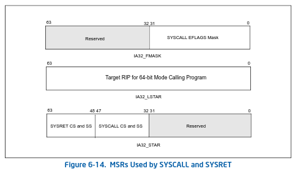

The SYSCALL instruction does not save the stack pointer, and the SYSRET instruction does not restore it. It is likely that the OS system-call handler will change the stack pointer from the user stack to the OS stack. If so, it is the responsibility of software first to save the user stack pointer. This might be done by user code, prior to executing SYSCALL, or by the OS system-call handler after SYSCALL.

Because the SYSRET instruction does not modify the stack pointer, it is necessary for software to switch back to the user stack. The OS may load the user stack pointer (if it was saved after SYSCALL) before executing SYSRET; alter-natively, user code may load the stack pointer (if it was saved before SYSCALL) after receiving control from SYSRET.

If the OS loads the stack pointer before executing SYSRET, it must ensure that the handler of any interrupt or exception delivered between restoring the stack pointer and successful execution of SYSRET is not invoked with the user stack.

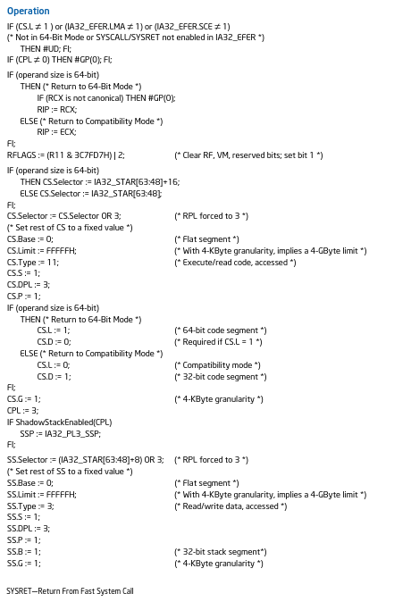
From the details of SYSRET, we can see ```CS.SELECTOR := CS.SELECTOR OR 3;```. The microcode makes always sure returning back to userspace => it is forcing use into ring 3. This is one of theses consequences of rings 1 and 2 never being used.

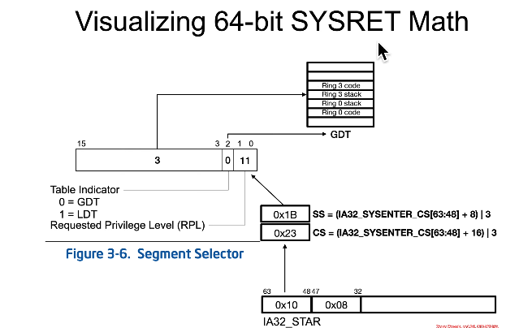


SYSENTER/SYSEXIT are preferred on 32-bit systems, because they're supported on both Intel and AMD (was created before AMD's x86-64 extensions).

##### Syscall-adjacent Tech (swapgs, {rd,wr}{fs,gs}base)

**SWAPGS**
When using SYSCALL to implement system calls, there is no kernel stack at the OS entry point. Neither is there a straightforward method to obtain a pointer to kernel structures from which the kernel stack pointer could be read. Thus, the kernel cannot save general purpose registers or reference memory.
=> The SWAPGS instruction is designed to help with the above issue  
 Exchanges the GS base linear address (mapped to IA32_GS_BASE) with the one found in the IA32_KERNEL_GS_BASE MSR (0xC0000102). Useful for interrupt handlers as wel as SYSCALL handlers.
 
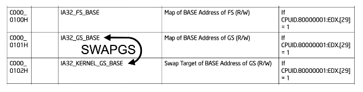


Generally speaking OSes use FS and GS to point at global data structures that they want to easily be able to access.

x86-64:
- Userspace: FS => Thread Local Storage (TLS), GS => The GS segment has no common use
- Kernel: FS => Unused, GS => Per-CPU variables
x86-32: 
- Userspace: FS => Unused, GS => Thread Local Storage (TLS)
- Kernel: FS => Unused, GS => Unused

if CPUID.07H.0H:EBX.FSGBASE[bit 0] = 1 && CR4.FSGSBASE = 1
=> it means that the processor supports the following instructions :
- ```RDFSBASE```/```WRFSBASE```
- ```RDGSBASE```/```WRGSBASE```
Which can be used instead of ```RDMSR```/```WRSMR``` to ```read```/```write``` the FS and GS base addresses.
["A possible end to the FSGSBASE saga"](https://lwn.net/Articles/821723/)


#### Read the TimeStamp Counter (RDTSC)
What's the time ? Time to ReaD (the) Time-Stamp Counter
The TSC is a 64bit counter introduced in the Pentium
Set to 0 when processor reset, incremented on each clock cycle thereafter.

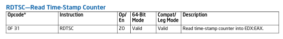

Reads the current value of the processor’s time-stamp counter (a 64-bit MSR) into the EDX:EAX registers. The EDX register is loaded with the high-order 32 bits of the MSR and the EAX register is loaded with the low-order 32 bits. (On processors that support the Intel 64 architecture, the high-order 32 bits of each of RAX and RDX are cleared.)

- The counter also can be read out of IA32_TIME_STAMP_COUNTER (0x10) MSR
- It can set bit 2 in Control Register 4 so that only Ring 0 can use the instruction.
- Processor families increment the timestamp counter differently (see Vol 3, Sect 17.17)
- VM Extensions have special provisions to help hypervisors lie to VMs about RDTSC contents

The processor monotonically increments the time-stamp counter MSR every clock cycle and resets it to 0 whenever the processor is reset.

The time stamp disable (TSD) flag in register CR4 restricts the use of the RDTSC instruction as follows. When the flag is clear, the RDTSC instruction can be executed at any privilege level; when the flag is set, the instruction can only be executed at privilege level 0.

The time-stamp counter can also be read with the RDMSR instruction, when executing at privilege level 0.

The RDTSC instruction is not a serializing instruction. It does not necessarily wait until all previous instructions have been executed before reading the counter. Similarly, subsequent instructions may begin execution before the read operation is performed. The following items may guide software seeking to order executions of RDTSC:
- If software requires RDTSC to be executed only after all previous instructions have executed and all previous loads are globally visible,1 it can execute LFENCE immediately before RDTSC.
- If software requires RDTSC to be executed only after all previous instructions have executed and all previous loads and stores are globally visible, it can execute the sequence MFENCE;LFENCE immediately before RDTSC.
- If software requires RDTSC to be executed prior to execution of any subsequent instruction (including any memory accesses), it can execute the sequence LFENCE immediately after RDTSC.

### Paging
- Logical Address: Far pointer that specifies a segment selector + offset in that segment
- Linear Address: Flat 32/64 notional address-space, post-segmentation
- Virtual Address: Address that takes paging into account
- Physical Address: Offset into physical RAM


It's called "paging" because physical memory is divided into fixed size chunks called _pages_.

When paging is enabled, a linear address is the same thing as a virtual memory address or virtual address. 
Memory Management Unit => chunk of hardware in a processor which uses the current execution mode, segmentation information, and paging information to perform the overall process of translating logical to physical memory addresses.
The Translation Lookaside Buffer (TLB) is a cache of Virtual -> Physical mappings the MMU consults.
Paging makes memory access virtual in that no longer does the linear address correspond to the exact same physical address sent out on the bus lines to RAM (as it does when paging is disabled). Low addresses can map to high addresses, or low addresses, or no addresses.

There are 5 Control Registers (CR0-CR4) which are used for paging control as well as enabling/disabling other features.

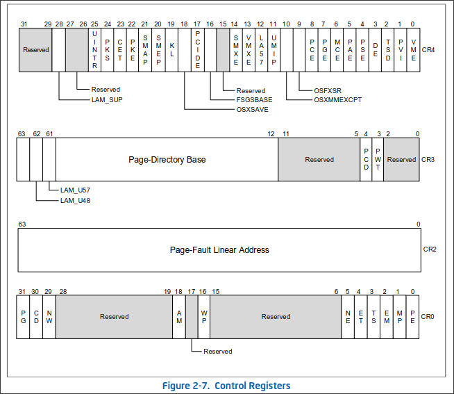

**CR0**
- Protection Enabled (PE, bit 0): this is how the system gets from real mode to protected mode. It must be set to get into Protected Mode from the default reset state of Real Mode.
- Write Protect (WP, bit 16): stops ring 0 from writing to read-only pages. It is used to facilitate "Copy on Write" in OSes. It also plays a role in SMAP/SMEP logic.
- Paging Enabled (PG, bit 31): must be set to enable paging. Requires PE to be set.

**CR3**
Points at the start of the page tables, which the MMU walks to translate virtual memory to physical.

**CR2**
CR2 is used when the mmu try to lock the page table but something goes wrong => If the virtual to physical lookup can't complete for some reason (e.g. permissions, or just because there's no mapping in the page tables) a "page fault" (INT 14) is signaled. 
CR2 records the linear address which was attempted to be translated via a page table walk.

**CR4**
- Page Size Extensions (PSE, bit 4): Allows for pages > 4KB
- Physical Address Extension (PAE, bit 5): Allows physical addresses
- Page Global Enable (PGE, bit 7): a feature to make caching page table information more efficient
- 57-bit linear addresses (LA57, bit 12): a new and even larger memory address space is accessible


If CR0.PG = 1, a logical processor is in one of four paging modes, depending on the values of CR4.PAE, IA32_EFER.LME, and CR4.LA57. 
The following items identify certain limitations and other details:
- IA32_EFER.LME cannot be modified while paging is enabled (CR0.PG = 1). Attempts to do so using WRMSR cause a general-protection exception (#GP(0)).
- Paging cannot be enabled (by setting CR0.PG to 1) while CR4.PAE = 0 and IA32_EFER.LME = 1. Attempts to do so using MOV to CR0 cause a general-protection exception (#GP(0)).
- One node in Figure 5-1 is labeled “IA-32e mode.” This node represents either 4-level paging (if CR4.LA57 = 0) or 5-level paging (if CR4.LA57 = 1). As noted in the following items, software cannot modify CR4.LA57 (effecting transition between 4-level paging and 5-level paging) without first disabling paging.
- CR4.PAE and CR4.LA57 cannot be modified while either 4-level paging or 5-level paging is in use (when CR0.PG = 1 and IA32_EFER.LME = 1). Attempts to do so using MOV to CR4 cause a general-protection exception (#GP(0)).
- Regardless of the current paging mode, software can disable paging by clearing CR0.PG with MOV to CR0.

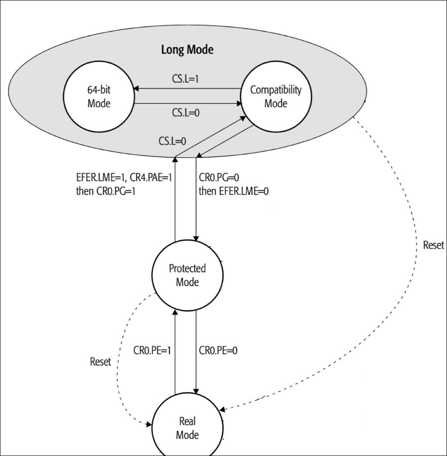

- Software can transition between 32-bit paging and PAE paging by changing the value of CR4.PAE with MOV to CR4.
- Software cannot transition directly between 4-level paging (or 5-level paging) and any of other paging mode. It must first disable paging (by clearing CR0.PG with MOV to CR0), then set CR4.PAE, IA32_EFER.LME, and CR4.LA57 to the desired values (with MOV to CR4 and WRMSR), and then re-enable paging (by setting CR0.PG with MOV to CR0). As noted earlier, an attempt to modify CR4.PAE, IA32_EFER.LME, or CR.LA57 while 4-level paging or 5-level paging is enabled causes a general-protection exception (#GP(0)).
- VMX transitions allow transitions between paging modes that are not possible using MOV to CR or WRMSR. This is because VMX transitions can load CR0, CR4, and IA32_EFER in one operation.


Accessing control registers can be done with their own MOV instructions ```MOV CR4, r64``` and ```MOV r64, CR```. Different opcodes than normal MOVs, no fancy r/mX form. Only register to register. 

**Paging Permutations**

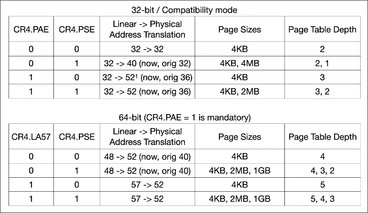

MAXPHYADDR is the maximum physical address size and is indicated by CPUID.80000008H:EAX[bits 7-0].
MAXLINADDR is the maximum linear address size and is indicated by CPUID.80000008H:EAX[bits 15-8 ].

CR4.PEA control whether or not we can access large areas of physical memory and CR4.PSE control whether or not we can have pages which are greater than 4KB.
So without CR4.PSE, it's always 4KB and with them, it can be larger : 2MB, 4MB, 1GB.
The sizes of linear address to physical address translation that occur at different configurations started with 32->32 then we have with addition of CR4.PSE that supports a physical address space of 40bits.


**32bit Linear to 32bit Physical, 4KB Pages**

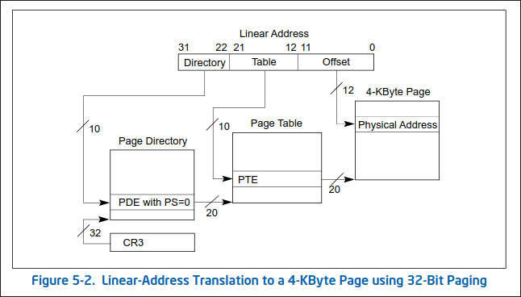

All begins with a 32-bit linear address in 32-bit mode, then we have our CR3 which is also 32bits on a 32-bit system. That gives us a base address of a table. This table has 2¹⁰ 4-byte entries insode of it, and so if we use the top 10 bits of the linear address as an index into this table, it will select on of those 2¹⁰ entries inside of this tables. If the top 10 bits was 0 then we would be pointing at entry number 0. If the top 10 bits was 0x3FF, then we'd pointing at the highest entry inside of this table.
Each entry in this 32-bit mode is 4bytes. 20 of the 32bits is an entry are used to specify the upper 20 bits of the address of another table. The bottom 12 bits are assumed to be 0.

=> The table must be on a 12-bit aligned address so this entry we said it every entry is 4 bytes so the 20 most significant bits of this entry are going to be used for the table address. The the MMU reads this value and it assumes the bottom 12 bits are all 0 so it expects that it ends in 0x0000 therefore because the MMU is able to assume that the bottom 12 bits are 0, si it can reuse the 12 bits for various flags and things. In order for this table to behave correctly, it needs to be placed at an address that ends in 0x000, aka is a multiple of 0x1000 (0, 0x1000, 0x2000, ...). This is called being "page-aligned", since a page is 0x1000 (4KB). 


So, those 20bits are going to point us at table 2. Table 2 is going to be 2¹⁰ 4byte entries so we are again going to grab 10bits out of the linear address, and we are going to use those as an index into table 2 to find some entry that again is going to be some sort of 4 byte data structure once again, it's going to use 20bits and assume the bottom 12 bits are zeros and that will give us the address of the page that we're ultimately looking for.

Finally, we find ourselves at the 4 KB page at some address that is page aligned 0x0000. So 2¹² bytes, so that perfectly aligns with the fact that we have got 12 bits left in our 32-bit Linear Address, that can be used as an offset into the page to find the bytes that we are looking for. If the 12 least significant bits were 0, we would be pointing at the zero byte of the page and if the 12 least significant bits were 0xffc and if the processor happened to be doing a 4 byte fetch, then it would be 0xffc and it would fetch four bytes and it would get "\$\$BY"


**32bit Linear to 32bit Physical, 4MB Pages**
The only difference here is that CR4.PSE is set to 1 and therefore, if the operating system wants, it can use 4 MB pages at a depth of 1 instead of 4KB pages at depth of 2. 

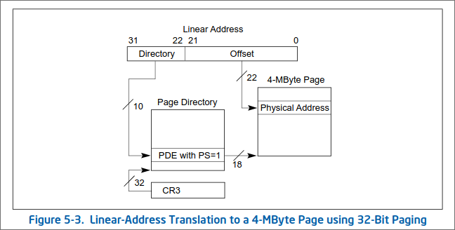

The PDE entry is going to only use 10 bits instead of 20 bits, like it used last time. So that means that the most significant 10 bits are going to be used as part of a physical address of the next 4 MB page where the bottom 22 bits are all assumed to be 0. That leaves 22 bits for flags and stuff just like there were 12 bits available in 4KB paging.


**32bit Linear to 40bit Physical, Physical Address Extensions (PAE)**
No one to one mapping is possible so, when the processor say "gimme memory address at 7GB" this is not possible because this is greater than a 32-bit  address so if it tries that then a whole bunch of nothing's going to happen (registers don't hold more than 32 bits).

Here, thanks to PAE, an operating system could create a page table that could actually do the work of translating something like "gimme memory address at 3GB" to make that access physical RAM at 7GB. So the processor is able to access all the RAM and the operating system can not have to use virtual memory in the swapping to disk 

**48bit Linear to 52bit Physical, 4-level Paging, 4KB, 2MB, 1GB Pages**
It's actually MAXPHYADDR-12 not juste hardcoded 40

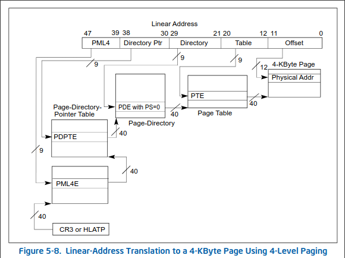

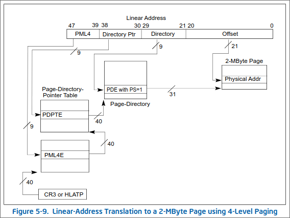

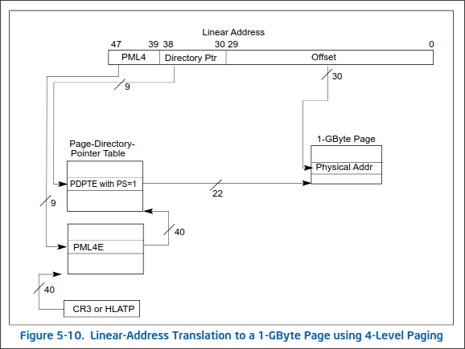

**57bit Linear to 52bit Physical, 5-level Paging**
Behaves just like 4-Level/48-bit Linear Address Paging (just adds another level)
When we turned on CR4.PAE, its doesn't support anything larger than 1GB pages.

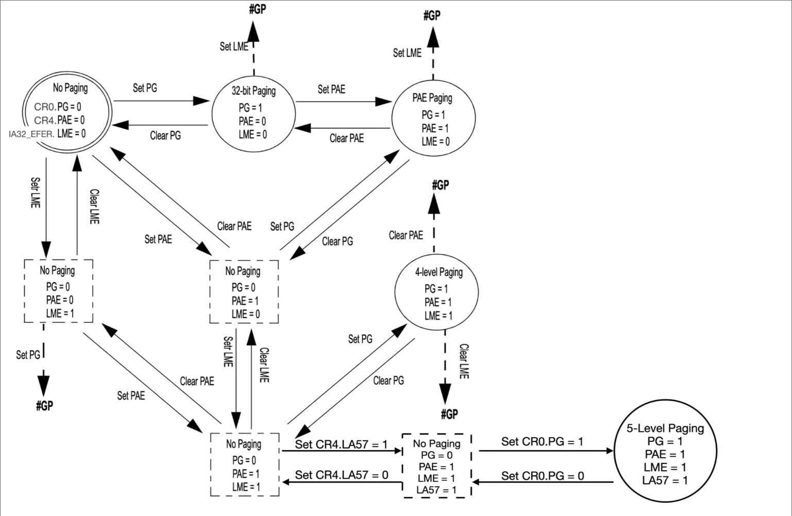


**CR3 with 4-Level Paging**
bits[51:12] are the MSBs of the physical address where the PML4 (Page Map Level 4) table can be found. PML4 table must be 0x1000-aligned, so that the bottom 12 bits are 0. PCD/PWT have to do with caching. When OSes context switch between different processes, they will change the contents of CR3 to point at different page table hierarchies.

**Page Map Level 4**
- Bit 0 is the Present (P) bit. Attemps to access a linear address which coresponds to a PML4E with P == 0, will cause a Page Fault (#PF, INT 14). Only if P is 1 are the other bits considered by the MMU. An OS should zero-initialize the entire PML4 before filling in select entries for the Virtual -> Physical mappings it wants
- Bit 1  is the Read/Write (R/W) flag. If 1, reads and writes are allowed. If 0, only reads are allowed. Attempts to write to a R/W == 0 page yields a PF. 
- Bit 2 is the User/Supervisor (U/S) flag. If 0, only CPL < 3 (Supervisor) accesses are allowed. If 1, any CPL (User & Supervisor) allowed. Attemps to access U/S == 0 page in CPL == 3 yields a PF
- Bit 63 is the Execute Disable (XD) bit. If this is 1, and the MMU is walking through this entry to fetch instructions from memory for execution, then PF. The bit originally called NO-Execute (NX) in the AMD x86-64 extensions.

Each PML4E points to a PDPTE (Page Directory Pointer Table Entry). 
A PDPTE is an entry in the Page Directory Pointer Table (PDPT). The PML4E points to this table. Each PDPTE points to a Page Directory Entry (PDE). 
A PDE is an entry in the Page Directory (PD). Each PDE points to a Page Table Entry (PTE).
A PTE is an entry in the Page Table (PT). Each PTE contains a pointer to a physical memory page, as well as the metadata like access permissions

**Full Hierarchy in the 4-Level Paging System**
CR3 → PML4E → PDPTE → PDE → PTE → Physical Address.

Each table (PML4, PDPT, etc) contains 512 entries, each 8 bytes size. Virtual addresses in 64-bit mode typically use only the lower 48 bits. 

**PML4Es with 4-Level Paging**
- Bit 1 is the Read/Write (R/W) flag
- Bit 2 is the User/Supervisor (U/S) flag
- Bit 63 is the Execute Disable (XD) bit
=> These are access control mechanisms limiting what user or kernel code can do 
- Bits [M-1:12] are used to calculate the physical address where the PDPT can be found by the MMU. PDPT should be 0x1000 aligned (aka page-aligned), the bottom 12 bits of its address should be 0.

**Exploit Mitigations: SMAP/SMEP**
- Supervisor-Mode Access Prevention (SMAP): don't let ring 0 (supervisor) read/write non-supervisor (U/S\==1) pages.
- Supervisor-Mode Execution Prevention (SMEP): don't let ring 0 (supervisor) execute non-supervisor (U/S\==1) pages.

**PDPTEs with 4-Level Paging**
- Bit 6 is the Dirty (D) bit. It is often used by OSes to know whether a given memory location has been written to. This can be used in OS strategies for evicting RAM to disk when they run out of free RAM.
- Bit 7 Page Size (PS) indicates whether this entry should be interpreted as pointing at a 1GB page, or a Page Directory. 
- Bit 8, the Global (G) bit, affects caching of Virtual -> Physical translations in the Translation Lookaside Buffer (TLB). If 0, the mapping will be flushed when CR3 is changed. If 1, it will be retained on CR3 changes.
- If it is a 1GB page, then bits [M-1:30] are the upper bits of the physical address of the page, and the bottom 30bits need to be zero (1GB-page-aligned)

**PDEs with 4-Level Paging**
- Bit 7 Page Size (PS) indicates whether this entry should be interpreted as pointing at a 2MB page, or a Page Table
- If it is a 2MB page, then bits [M-1:21] are the upper bits of the physical address of the page, and the bottom 21 bits need to be zero (2MB-page-aligned)
- P, R/W, U/S, D, G, and XD bits all behave exactly the same as they did in the PDPTE

**PTEs with 4-Level Paging**
- P, R/W, U/S, D, G and XD bits all behave exactly the same as they did in the PDPTE & PDE
- Bits [M-1:12] are the upper bits of the physical address of the page, and the bottom 12 bits need to be zero (4KB-page-aligned)

**Canonical Addresses**
Current "64-bit system" processors can't actually use a 64-bit linear address space or a 64-bit physical address space. At most, Intel processors currently support a 57-bit Linear, and 52-bit Physical address space. 
A canonical address is one in which the upper N unused bits must always all be 0 or 1. The processor sign-extends the most significant bit of the linear address space to the upper N unused bits. 
A linear address is 48-bit canonical if bits 63:47 of the address are identical. Similarly, an address is 57-bit canonical if bits 63:56 of the address are identical. Any linear address is that 48-bit canonical is also 57-bit canonical.
Attempts to access non-canonical linear addresses leads to a General Protection (#GP) fault. Causing #GPs through non-canonical access at opportune times has been implicated in a few interesting vulnerabilities in multiple OSes and virtualization systems


**Page Faults**
What are the consequences if the MMU is walking the page tables and it encounters a P\*E (PML4E, PDTPE, PDE, PTE) that has the Present bit set to 0 ?
=> It invokes a Page Fault #PF (IDT[14]). The page fault handler then determines whether it can recover from the fault. 
When a Page Fault occurs, the address that the MMU was attempting to translate to a physical address automatically put into the CR2 register.
Page fault pushes an Error Code and so the Page Fault Handler is responsible for interpreting that error code.


**Translation Lookaside Buffer (TLB)**
Virtual address come from the CPU, the MMU is responsible for walking page table and translating virtual addresses into physical addresses that is put into RAM. There is this side lookup with the TLB which is a cache of virtual to physical.
TLB is an in-package cache which stores translations between linear addresses and physical pages. The idea being that memory accesses will be faster when the hardware does not have to walk from CR3 through all the in-memory page tables. 
By caching a map which describes which linear page corresponds to which physical page, the hardware can just use the frame number ORed with the least significant x bits which specifies the offset into the page. Where x depends on what type of paging layout we're using :
- 4KB pages x = 12 (2¹² = 4KB)
- 2MB pages x = 21 (2²¹ = 2MB)
- 4MB pages x = 22 (2²² = 4MB)
- 1GB pages x = 30 (2³⁰ = 1GB)
The TLB is logically similar to the way that the "hidden" part of a segment register stores the information from a segment descriptor, so that the MMU doesn't have to go look up information from the GDT all the time. Except, it's more complicated in that the TLB is a real cache and follows layout like other types of caches.
Whenever CR3 is set to a new value (only ring 0 can MOV a value to CR3), all TLB entries which are not marked as global are flushed (bit 8 G == 1)
Ring 0 code can also use the ```INVLPG``` instruction to invalidate the TLB cache entry for a specified virtual memory address.
There are actually multiple TLBs. The newest chips typically have 6: 
- 3x Data TLBs (DTLBs): Separate ones for each of the 4K, 2/4MB, 1GB page sizes
- 2x Instruction TLBs (ITLBs): Separate ones for each of the 4K, 2/4MB page sizes
- 1X Shared TLB (STLB) aka L2 TLB: Shared between ITLB & DTLBs
Number of entries in the cache differs between chip microarchitectures and revisions. 

**Non-executable Memory (NX/XD bit)**
Intended to help (FW/OS/VMM) software build exploit mitigations by marking areas such as the stack and heap as non-executable.
The bit helps implement a "W^X" (write xor execute) policy whereby memory can either be writable or executable but not both. In pre-x86-64 segmentation all data segments were non-executable, but no one used segmentation for this. 
Any pages which have a PTE, PDE, or PDPTE with the XD = 1, are non executable. XD bits encountered earliest in the page table walk take precedence over later ones. 

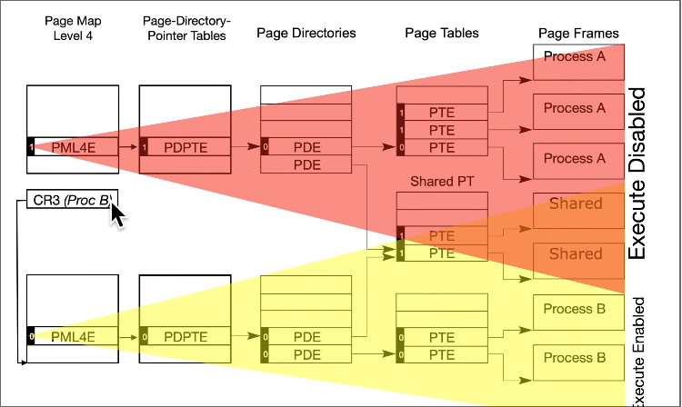

Attempts to execute from non-executable pages results in a Page Fault (#PF). Microsoft refers to the utilization of XD as Data Execution Prevention (DEP) or "Hardware DEP". "Software DEP" refers to MS'S Structured Exception Handler sanity checking ("SafeSEH") and has nothing to do with XD.
How do we know if a particular processor support the NX bit ? 
=> MSR bit 11 : Bit Enable IA32_EFER.NXE (R/W)

**Interrupts & Debugging**
IDT[3] is the Breakpoint Exception, and it's important enough for "INT3" to have a separate one byte opcode form (0xCC). INT3 is what debuggers are using when they say they are setting a "software breakpoint".
When a debugger uses a software breakpoint, what it does is overwrite the first byte of the instruction at the specified address. It keeps its own list of which bytes it overwrote and where. When a breakpoint exception is received, it looks up the location, replaces the original byte and lets the instruction execute normally. Then typically it overwrites the first byte again so that the breakpoint will be hit if the address if executed again.

**Hardware Breakpoints**
There are 8 debug registers DR0-DR7:
- DR0-3 : breakpoint linear address registers
- DR4-5 : reserved (unused)
- DR6 : Debug Status Register
	- B0-B3 (breakpoint condition detected) flags: When B{0,1,2,3} bit is set, it means that the {0th,1th,2th,3th} condition specified in DR7 has been satisfied. The bits are set even if the DR7 says that condition is currently disabled. 
	- BD (debug register access detected) flag: indicates that the next instruction will try to access the debug registers. This flag only enabled if GD (general detect) flag in DR7 is set. Thus this signals if someone else was trying to access the debug registers.
	- BS (single step) flag: if set, the debug exception was triggered by single-step execution mode
- DR7 : Debug Control Register
	- L0-3 (local breakpoint enable) flags : Enables the DR0-3 breakpoint. These flags are cleared on task switches to ensure that ehy do not fire when dealing with a different task
	- G0-3 (global breakpoint enable) flags : Enables the DR0-3 breakpoint. Does not get cleared on task switch, which is what makes it global.
	- LE & GE (local and global exact breakpoint enable) flags : Not supported on x86-64 processors.
	- GD (General Detect) flag: if set to 1, causes a debug exception (#DB, IDT[1]) prior to MOV instructions that access the debug registers. The flag is cleared when the actual exception occurs, so that the handler can access the debug register as needed. This can serve as a way of stopping other code from modifying the DRs
	- R/W0-3 are interpreted as follows : 
		- 00 : Break on instruction execution only
		- 01 : Break on data writes only. 
		- if CR4.DE == 1 then 10 then Break on I/O reads or writes
		- if CR4.DE == 0 then 10 then Undefined
		- 11 then Break on data reads or writes
	- LEN0-4 bits specify what size the address stored in DR0-3 registers should be treated as : 
		- 00: 1-byte
		- 01: 2-bytes
		- 10: 8 bytes (on x86-64 only)
		- 11: 4-bytes

Accessing the debug registers requires CPL == 0

**Resume Flag (RF)**
What happens when a Hardware Breakpoint Fires ?
It fires IDT[1], a Debug Exception (#DB). When it is an execute breakpoint or general detect it's a fault. For other cases, it's a trap. That means if it was a break on write, the data is overwritten before the exception is generated. A handler which wants to show the before and after is responsible for keeping a copy of the before value. Instruction breakpoints are actually detected before the instruction executes . Therefore if the handler doesn't remove the breakpoint, and it just returned, the same exception would be raised over and over. This is where the Resumse Flag (RF) comes into play. 
When the RF is set "The processor then ignores instruction breakpoints for the duration of the next instruction." "The processor then automatically clears this flag after the instruction returned to has been successfully executed". To set the flag, a debug interrupt handler must manipulate the RFLAGS stored on the stack and then use IRETQ (POPFQ does not transfer RF from the stack into RFLAGS) under any circumstances.

**Trap Flag (TF)**
When TF is 1, it causes a Debug Exception after every instruction. This is called "single-step" mode. Useful for capabilities such as "step into", but also for "step out" which just single-steps until it steps through a RET. If the debug exception is in response to "single stepping", it sets the DR6.BS flag. The processor clears the TF flag before calling the exception handler, so if the debugger wants to keep single-stepping it needs to set it again before returning.

**Port I/O**
In addition to transferring data to and from external memory, IA-32 processors can also transfer data to and from input/output ports (I/O ports). I/O ports are created in system hardware by circuity that decodes the control, data, and address pins on the processor. These I/O ports are then configured to communicate with peripheral devices. An I/O port can be an input port, an output port, or bidirectional port. 
There are 2¹⁶ 8-bit IO ports, numbered 0-0xFFFF. Can combine 2 or 4 consecutive ports to achieve a 16 or 32 bit port. 32-bit ports should be aligned to addresses that are multiples of four (0,4,8,...). 
We cannot use the IN/OUT instructions to access the ports unless we ahve sufficient privileges. There  is a 2 bit IOPL (I/O Privilege Level) field in RFLAGS. We can only perform IO if CPL <= IOPL.